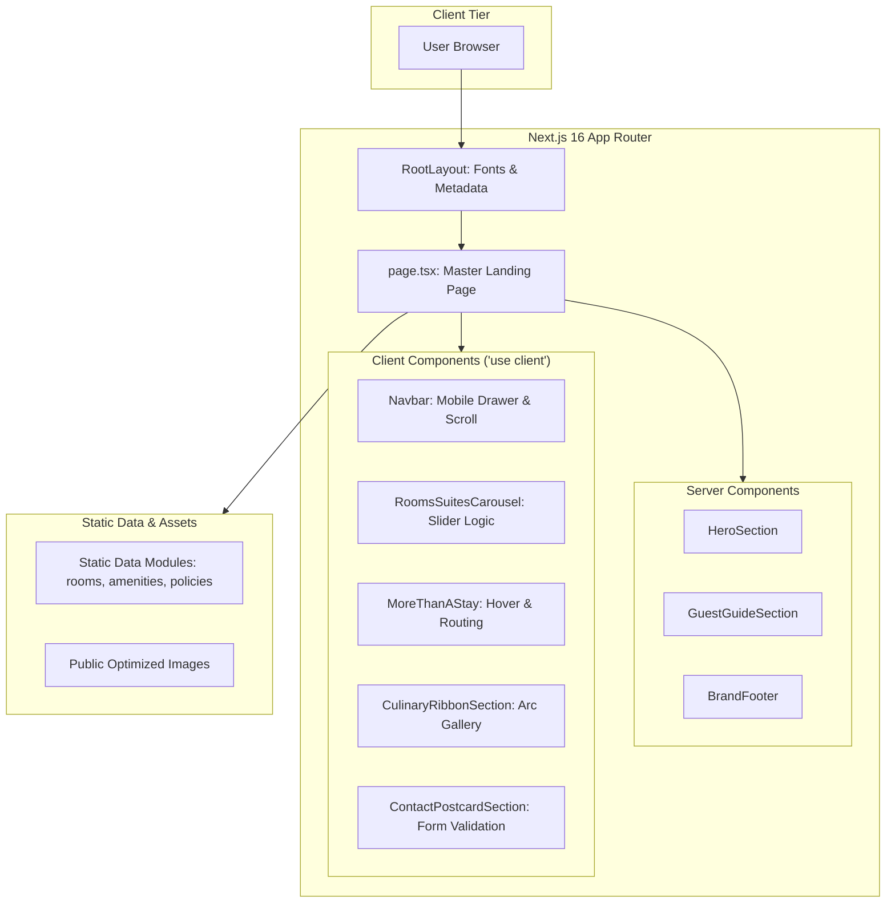

# Architecture & Technical Design: Hotel Itagi Square

This document outlines the architecture, data models, rendering strategies, directory organization, and performance standards for the Hotel Itagi Square website.

---

## 1. System Architecture

The application is built on **Next.js 16 (App Router)** and **React 19**, leveraging Server Components for lightning-fast initial load times and optimized Core Web Vitals, combined with Client Components for rich micro-interactions.



---

## 2. Directory Structure

```
itagi-square/
├── app/
│   ├── favicon.ico
│   ├── globals.css              # Tailwind v4 @import & @theme tokens
│   ├── layout.tsx               # Root layout, Google Fonts (Cormorant & Inter), SEO metadata
│   ├── page.tsx                 # Composed landing page
│   └── api/
│       └── contact/
│           └── route.ts         # Contact / Reservation inquiry API handler
├── components/
│   ├── ui/                      # Base primitives
│   │   ├── button.tsx           # Luxury button variants
│   │   ├── underline-input.tsx  # Underlined minimalist inputs
│   │   ├── room-spec-badge.tsx  # Spec metrics (m2, bed, guests)
│   │   └── vintage-divider.tsx  # Botanical engraving divider SVG
│   ├── molecules/               # Reusable composites
│   │   ├── room-card.tsx        # Two-tone room card
│   │   ├── pillar-card.tsx      # Experience portrait card
│   │   ├── curved-ribbon-gallery.tsx # Curvilinear dining ribbon
│   │   ├── policy-column.tsx    # Policy column item
│   │   ├── amenity-column.tsx   # Amenity column item
│   │   └── newsletter-form.tsx  # Footer email subscription pill
│   └── sections/                # Full landing page sections
│       ├── navbar.tsx           # Frosted glass navigation
│       ├── hero-section.tsx     # Fullscreen facade hero
│       ├── rooms-suites-section.tsx # Rooms carousel
│       ├── more-than-a-stay-section.tsx # 4 experience pillars
│       ├── culinary-showcase-section.tsx # Curvilinear ribbon gallery
│       ├── guest-guide-section.tsx # "Before You Arrive" & "Amenities"
│       ├── contact-postcard-section.tsx # Vintage postcard inquiry
│       └── brand-footer.tsx     # Royal purple footer
├── data/                        # Type-safe static datasets
│   ├── rooms.ts                 # Suite Room, Executive Suite, Executive Room
│   ├── experiences.ts           # Unwind, Dine, Explore, Connect
│   ├── culinary.ts              # Indo-Arabic dishes and imagery
│   ├── policies.ts              # Check-in, proximity, essentials
│   └── amenities.ts             # Hotel, Dining, Fitness, Rooms
├── types/                       # TypeScript contracts
│   ├── room.ts
│   ├── experience.ts
│   ├── culinary.ts
│   ├── guide.ts
│   └── contact.ts
├── public/
│   ├── images/                  # High-res hotel, room, dining photography
│   │   ├── hero-entrance.png
│   │   ├── rooms/
│   │   ├── experiences/
│   │   └── dining/
│   └── icons/                   # Botanical SVGs, ticket motifs, logos
├── ui-tokens.md
├── ui-rules.md
├── ui-registry.md
├── code-standards.md
├── build-plan.md
├── progress-tracker.md
└── project-overview.md
```

---

## 3. Server vs. Client Component Strategy

| Component | Strategy | Rationale |
| :--- | :--- | :--- |
| `layout.tsx` | **Server** | Injects font links, JSON-LD structured data, metadata tags without client JS bundle impact. |
| `page.tsx` | **Server** | Orchestrates page structure and fetches static datasets at build time. |
| `HeroSection` | **Server** | Static visual presentation; zero client bundle overhead; instant First Contentful Paint. |
| `Navbar` | **Client** (`"use client"`) | Requires scroll detection for header blur transition and mobile navigation drawer state. |
| `RoomsSuitesCarousel` | **Client** (`"use client"`) | Requires touch swipe listeners, keyboard arrow controls, and active index transitions. |
| `MoreThanAStaySection` | **Server** | Renders static cards with CSS hover transforms. |
| `CulinaryShowcaseSection`| **Server** | Architectural ribbon rendered via pure CSS / SVG mask; minimal client JS. |
| `GuestGuideSection` | **Server** | Static structured text content; SEO indexed cleanly by crawlers. |
| `ContactPostcardSection`| **Client** (`"use client"`) | Form field validation, input masking, date pickers, submit loading state. |
| `BrandFooter` | **Client** (`"use client"`) | Interactive newsletter form submission. |

---

## 4. Core Data Models

### 4.1 Room & Accommodation Model
```typescript
export interface RoomData {
  id: string;
  title: string;
  category: 'suite' | 'executive-suite' | 'executive';
  tagline: string;
  description: string;
  image: string;
  area: string;       // e.g. "21 sq m"
  bedType: string;    // e.g. "King Bed"
  maxGuests: string;  // e.g. "Up to 3 guests"
  features: string[];
  pricing?: {
    startingFrom: number;
    currency: string;
  };
}
```

### 4.2 Contact / Reservation Inquiry Model
```typescript
export interface ReservationInquiry {
  message: string;
  firstName: string;
  lastName: string;
  checkInDate: string;
  checkOutDate: string;
  guestsCount: number;
  roomsCount: number;
  email: string;
  mobile: string;
}
```

### 4.3 Guide & Policy Model
```typescript
export interface PolicyCategory {
  title: string;
  items: { label?: string; value: string }[];
}

export interface AmenityCategory {
  categoryName: 'HOTEL' | 'DINING' | 'FITNESS' | 'ROOMS';
  amenities: string[];
}
```

---

## 5. Asset Pipeline & Optimization

1. **Local Assets Migration**: High-resolution source images from `context/` will be cropped, organized, and moved to `public/images/` with WebP/PNG support.
2. **Next.js Image Component**: All images will use `next/image` with explicit `width`, `height`, `sizes`, and `priority` on above-the-fold assets (Hero Entrance).
3. **Curved Arc Clipping**: The "Good Food. Good Moments." section will use an inline SVG `clipPath` or standard CSS `clip-path: ellipse()` ensuring hardware-accelerated rendering and responsive scaling across viewports.
4. **Custom Botanical Vector**: The rosehip floral engraving in the contact form will be integrated as an optimized, clean inline SVG to prevent rendering artifacts.

---

## 6. Performance & Core Web Vitals Strategy

- **LCP (Largest Contentful Paint)**: Hero image preloaded with `priority={true}` and `fetchPriority="high"`.
- **CLS (Cumulative Layout Shift)**: Rigid aspect ratios defined for room cards (`aspect-[16/10]`), experience cards (`aspect-[4/5]`), and the curved dining ribbon.
- **FID / INP (Interaction to Next Paint)**: Zero heavy client libraries (pure Tailwind CSS animations and vanilla React hooks for slider logic).
- **SEO & Structured Data**:
  - Open Graph and Twitter card meta tags.
  - JSON-LD structured data with `@type: "Hotel"`, address, geo coordinates, amenities, and contact numbers.
