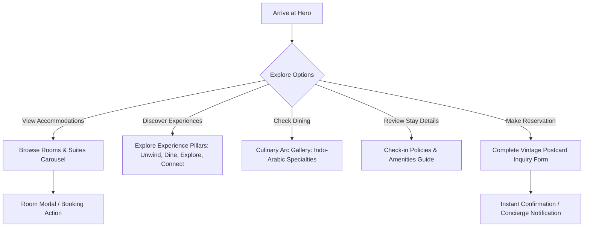

# Project Overview: Hotel Itagi Square

## 1. Executive Summary

**Hotel Itagi Square** is a premium luxury hospitality destination offering world-class accommodations, authentic Indo-Arabic fine dining, refined banquet spaces, and wellness experiences. 

This website project represents the official digital presence for Hotel Itagi Square. The platform is designed with an editorial, high-end aesthetic inspired by luxury Indian and heritage boutique hotels, balancing warmth, architectural grandeur, and seamless digital guest journeys.

---

## 2. Brand Identity & Visual Philosophy

The brand identity of Hotel Itagi Square bridges classical opulence with contemporary hospitality:

- **Grand Architectural Heritage**: Inspired by historic Indo-Islamic and regional stone architecture with ornate archways, warm amber illumination, and regal purple tones.
- **Warm Contemporary Luxury**: Uncluttered editorial layouts, spacious typography with generous tracking, and warm parchment/sand palettes that evoke calm and relaxation.
- **Culinary Distinction**: Dedicated culinary storytelling celebrating authentic Indo-Arabic flavours, tandoor specialties, and banquet feasts.
- **Editorial Vintage Craftsmanship**: Detailed touches like vintage postcard reservation forms with botanical engravings, scalloped ticket buttons, and two-tone suite presentation cards.

---

## 3. Analysis of Context Mockups

Based on the architectural and UI mockups provided in the `context/` directory:

| Design Mockup | Section / Component | Key Visual & Functional Elements |
| :--- | :--- | :--- |
| **`Desktop - 1.png`** | **Hero & Navigation** | • Fullscreen architectural photograph of the hotel entrance with towering palms and chandeliers. • Frosted translucent glass navbar (`LOGO`, `ROOMS & SUITES`, `DINING`, `MORE`). • Soft powder blue pill CTA (`BOOK NOW`). • Centered monumental all-caps serif headline: `HOTEL ITAGI SQUARE`. |
| **`Desktop - 3.png`** | **Rooms & Suites Carousel** | • Section title: `ROOMS AND SUITES` + descriptive subtitle. • Circular purple navigation controls (`<` and `>`). • 3 two-tone room cards: `SUITE ROOM`, `EXECUTIVE SUITE`, `EXECUTIVE ROOM`. • Room metrics with line icons (21 sq m, King Bed, Up to 3 guests). • Royal purple pill CTA (`EXPLORE ITAGI`). |
| **`Frame 36.png`** | **"More Than A Stay" Pillars** | • 4 tall rounded experience pillars with image backdrops. • Key pillars: `UNWIND`, `DINE`, `EXPLORE`, `CONNECT`. • Bottom label in luxury serif with circular arrow action icon (`→`). |
| **`Frame 39.png`** | **"Good Food. Good Moments."** | • Section title: `GOOD FOOD. GOOD MOMENTS.` + subtitle. • Distinctive panoramic curvilinear ribbon / architectural arc framing close-up gourmet dishes (kebabs, wok specialties, curries). • Centered royal purple CTA (`EXPLORE ITAGI`). |
| **`Frame 72.png`** | **Guest Guide & Amenities** | • **Before You Arrive**: 4-column editorial layout covering Policy Rundown, Contact Info, Local Proximity (Miramar Beach, Fontainhas, Adil Shah Palace, etc.), Hotel Essentials (GSTIN, Fact Sheet). • **Amenities**: 4-column structured checklist for Hotel, Dining, Fitness, Rooms. |
| **`Frame 41.png`** | **Vintage Postcard Contact** | • Vintage editorial postcard container with outer border. • Left: `CONTACT US` header + framed textarea for messages. • Center: Fine vertical dividing line with botanical rosehip floral engraving. • Right: Underlined minimalist inputs (Name, Surname, Check-In, Check-Out, Guests, Rooms, Email, Mobile). • Scalloped ticket CTA button (`SEND ⇒`). |
| **`Frame 42.png`** | **Royal Purple Brand Footer** | • Imperial purple gradient background. • Top: Logo, Socials, Booking Contacts, Quick Links, Newsletter Subscription pill. • Center: Monumental brand logotype `ITAGI` with `Hospitalities & Retails` signature. • Bottom: Legal copyright, terms, privacy links, and agency attribution (`KINGPIN Vision Forge`). |

---

## 4. Target Audience & Personas

1. **Luxury & Leisure Travelers**: Couples, tourists, and families seeking comfortable suites, prime location, and authentic hospitality.
2. **Business Executives & Corporate Travelers**: Demanding seamless Wi-Fi, meeting spaces, executive rooms, quick check-in, and central connectivity.
3. **Culinary Enthusiasts**: Guests attracted by Indo-Arabic cuisine, private dining, and fine banqueting.
4. **Event & Wedding Organizers**: Planners looking for premium banquet halls and interconnected accommodation suites.

---

## 5. Core User Journeys

---

## 6. Technology Stack

- **Framework**: [Next.js 16 (App Router)](https://nextjs.org/)
- **Library**: [React 19](https://react.dev/)
- **Styling**: [Tailwind CSS v4](https://tailwindcss.com/) with CSS-first `@theme` configuration
- **Language**: [TypeScript 5](https://www.typescriptlang.org/) (Strict Mode)
- **Icons**: [Lucide React](https://lucide.dev/) + Custom SVG graphics (botanical engraving, ticket scallops)
- **Typography**: Next/Font with Google Fonts (`Cormorant Garamond` / `Playfair Display` for serif, `Inter` for clean sans-serif)
- **Deployment Target**: Vercel / Node.js Production Server

---

## 7. Key Objectives & Success Metrics

- **Aesthetic Excellence**: Flawlessly translate the Figma mockups into a responsive, pixel-perfect, interactive web application.
- **Conversion Performance**: High click-through rate on `BOOK NOW` and `EXPLORE ITAGI` CTAs, with frictionless submission through the postcard contact form.
- **Performance**: 90+ Google Lighthouse score on Performance, Accessibility, Best Practices, and SEO.
- **Mobile Fidelity**: Fluid responsiveness across phones, tablets, laptops, and ultra-wide displays.
