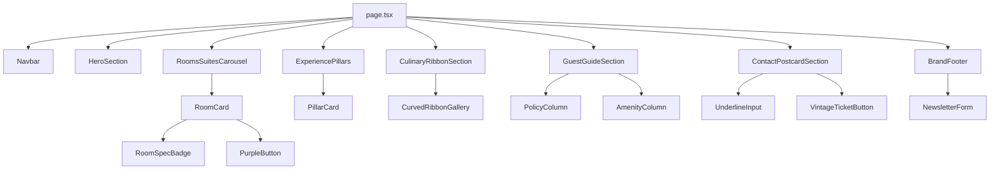

# UI Component Registry: Hotel Itagi Square

This registry catalogues all UI components built for Hotel Itagi Square, specifying their visual role, props contracts, variants, and interactive states.

---

## 1. Component Hierarchy Overview



---

## 2. Atomic Components

### 2.1 `Button`
Versatile button component implementing all primary luxury variants.

- **File Path**: `components/ui/button.tsx`
- **Variants**:
  - `hero-pill`: Powder sky blue pill (`#ADCDEE`) with dark typography.
  - `purple-pill`: Solid imperial purple (`#481454`) with white typography.
  - `vintage-ticket`: Scalloped peach ticket (`#F7E5D4`) with purple outline and drop shadow.
  - `icon-circle`: Circular purple button (`#481454`) with centered white SVG icon.
- **Props Interface**:
  ```typescript
  interface ButtonProps extends React.ButtonHTMLAttributes<HTMLButtonElement> {
    variant?: 'hero-pill' | 'purple-pill' | 'vintage-ticket' | 'icon-circle';
    size?: 'sm' | 'md' | 'lg';
    icon?: React.ReactNode;
    children?: React.ReactNode;
    className?: string;
  }
  ```
- **States**: Default, Hover, Focus, Active, Disabled, Loading.

### 2.2 `UnderlineInput`
Minimalist input field featuring an elegant bottom underline accent used in the vintage contact postcard.

- **File Path**: `components/ui/underline-input.tsx`
- **Props Interface**:
  ```typescript
  interface UnderlineInputProps extends React.InputHTMLAttributes<HTMLInputElement> {
    label?: string;
    error?: string;
    className?: string;
  }
  ```
- **States**: Default (subtle hairline `#8F7E71`), Focus (deep purple `#481454` with 2px underline), Error (crimson alert `#B91C1C`).

### 2.3 `RoomSpecBadge`
Composite indicator pairing a clean line icon with room metric data (area, bed, guests).

- **File Path**: `components/ui/room-spec-badge.tsx`
- **Props Interface**:
  ```typescript
  interface RoomSpecBadgeProps {
    icon: 'grid' | 'bed' | 'users';
    label: string;
    className?: string;
  }
  ```

---

## 3. Molecular Components

### 3.1 `RoomCard`
Two-tone accommodation presentation card.

- **File Path**: `components/molecules/room-card.tsx`
- **Design Reference**: `Desktop - 3.png`
- **Visual Composition**:
  - Top: High-resolution room image.
  - Bottom: Warm sand card face framed by an imperial purple base and side accents.
  - Room title in uppercase purple serif.
  - Description paragraph.
  - 3-item spec badge row.
  - "EXPLORE ITAGI" pill CTA.
- **Props Interface**:
  ```typescript
  export interface RoomData {
    id: string;
    title: string;
    description: string;
    image: string;
    area: string; // e.g. "21 sq m"
    bedType: string; // e.g. "King Bed"
    maxGuests: string; // e.g. "Up to 3 guests"
    link?: string;
  }

  interface RoomCardProps {
    room: RoomData;
    onExplore?: (id: string) => void;
  }
  ```

### 3.2 `PillarCard`
Tall portrait experience card featuring an edge-to-edge photo, bottom gradient, serif title, and circular arrow button.

- **File Path**: `components/molecules/pillar-card.tsx`
- **Design Reference**: `Frame 36.png`
- **Props Interface**:
  ```typescript
  export interface ExperiencePillar {
    id: string;
    title: 'UNWIND' | 'DINE' | 'EXPLORE' | 'CONNECT' | string;
    image: string;
    alt: string;
    href: string;
  }

  interface PillarCardProps {
    pillar: ExperiencePillar;
  }
  ```

### 3.3 `CurvedRibbonGallery`
Architectural arc ribbon displaying culinary specialties with concave top and convex bottom curves.

- **File Path**: `components/molecules/curved-ribbon-gallery.tsx`
- **Design Reference**: `Frame 39.png`
- **Visual Composition**:
  - WebGL cylinder projection with an SVG fallback and decorative outlines.
  - Three dish photographs sampled from the supplied artwork.
  - Scroll-controlled rotation with a pause/resume button and a static reduced-motion view.

### 3.4 `NewsletterForm`
Pill-shaped inline subscription component.

- **File Path**: `components/molecules/newsletter-form.tsx`
- **Design Reference**: `Frame 42.png`
- **Props Interface**:
  ```typescript
  interface NewsletterFormProps {
    onSubmit?: (email: string) => Promise<void>;
  }
  ```

---

## 4. Section Organisms

### 4.1 `Navbar`
- **File Path**: `components/sections/navbar.tsx`
- **Design Reference**: `Desktop - 1.png`
- **Features**: Frosted glassmorphism (`backdrop-blur-md`), brand logo, links (`ROOMS & SUITES`, `DINING`, `MORE`), mobile hamburger toggle, powder blue `BOOK NOW` CTA.

### 4.2 `HeroSection`
- **File Path**: `components/sections/hero-section.tsx`
- **Design Reference**: `Desktop - 1.png`
- **Features**: Full-bleed hotel entrance image and monumental serif headline "HOTEL ITAGI SQUARE"; no buttons.
- **Scroll motion**: GSAP ScrollTrigger with native scrolling and no pinning. Across the first 80% of the hero height, the image scales from 1 to 1.06 and the title rises 24px while fading out. Linear progress with 0.5-second scrub smoothing; scrolling back restores the original composition.
- **Responsive/accessibility**: Below 768px, scale ends at 1.03, title travel is 12px, and smoothing is 0.3 seconds. Reduced motion keeps the hero static and fully visible. Content is visible before JavaScript loads. Scoped React cleanup restores styles on unmount and when motion preferences change. The separate brand intro retains its existing behavior.

### 4.2.1 `BrandIntro`
- **File Path**: `components/sections/brand-intro.tsx` and `brand-intro.module.css`.
- **Visuals**: Full-screen sand (`#F4F0E8`) with a centered Cormorant Garamond ITAGI wordmark in purple (`#481454`). The ink fades into an SVG cutout of the actual hero; the cutout expands to reveal the page.
- **Motion**: Native Web Animations API; 1.95-second sequence after a bounded wait for the hero/font. Expansion uses `cubic-bezier(0.77, 0, 0.175, 1)`; ink and exit use `cubic-bezier(0.23, 1, 0.32, 1)`.
- **Behavior**: Home page only, on every full page load and refresh. Inline activation runs before first paint, with no session-storage limit. Remains hidden without JavaScript. Keyboard input dismisses immediately; reduced motion uses a 200ms fade. An independent 4.5-second timeout uncovers the page even if hydration fails.

### 4.3 `RoomsSuitesSection`
- **File Path**: `components/sections/rooms-suites-section.tsx`
- **Design Reference**: `Desktop - 3.png`
- **Features**: Section heading, descriptive subtitle, client carousel with swipe & circular purple prev/next controls (`<`, `>`), room cards.

### 4.4 `MoreThanAStaySection`
- **File Path**: `components/sections/more-than-a-stay-section.tsx`
- **Design Reference**: `Frame 36.png`
- **Features**: Section heading, 4 experience pillars (`UNWIND`, `DINE`, `EXPLORE`, `CONNECT`) with hover interactions.

### 4.5 `CulinaryShowcaseSection`
- **File Path**: `components/sections/culinary-showcase-section.tsx`
- **Design Reference**: `Frame 39.png`
- **Features**: Section heading "GOOD FOOD. GOOD MOMENTS.", subtitle, architectural curved arc ribbon gallery, centered "EXPLORE ITAGI" pill CTA.

### 4.6 `GuestGuideSection`
- **File Path**: `components/sections/guest-guide-section.tsx`
- **Design Reference**: `Frame 72.png`
- **Features**:
  - Part 1: "BEFORE YOU ARRIVE." 4-column editorial grid (Policies, Contact, Proximity landmarks, Hotel essentials).
  - Part 2: "AMENITIES" 4-column checklist (Hotel, Dining, Fitness, Rooms).

### 4.7 `ContactPostcardSection`
- **File Path**: `components/sections/contact-postcard-section.tsx`
- **Design Reference**: `Frame 41.png`
- **Features**:
  - Vintage postcard framed container.
  - Left: "CONTACT US" + message textarea.
  - Center: Botanical floral divider engraving.
  - Right: Underlined form fields (Name, Surname, Check-In, Check-Out, Guests, Rooms, Email, Mobile).
  - Scalloped ticket "SEND ⇒" button with validation & submit handling.

### 4.8 `BrandFooter`
- **File Path**: `components/sections/brand-footer.tsx`
- **Design Reference**: `Frame 42.png`
- **Features**: Deep royal purple background, booking contacts, support email, quick links, newsletter subscription, monumental "ITAGI Hospitalities & Retails" logotype, legal links, and Kingpin Vision Forge credit.


## 5. Scroll choreography

- **Shared entrances**: `hooks/use-scroll-reveal.ts` opts sections in through `data-reveal`. Desktop elements rise 24px while fading in over 600ms, with a 70ms stagger and `cubic-bezier(0.23, 1, 0.32, 1)`. Entrances run once at 88% of the viewport. Mobile travel is 12px. Focus or pointer interaction completes the section's entrances immediately. Reduced motion and unhydrated content remain visible; GSAP contexts clean up on navigation and breakpoint changes.
- **About**: Statement lines and the experience copy reveal separately. The mobile statement reveals as one block to preserve natural line wrapping. Existing opposing photo strips remain scroll-linked.
- **Rooms**: Heading/subtitle and visible cards reveal in groups; cards use 500ms. Carousel arrows, swipe, and keyboard controls retain their behavior, with no repeat entrance on slide changes.
- **Experience imagery**: Photographs use a taller, top-aligned crop to exclude the source artwork’s baked-in titles and buttons. Live labels remain readable in both layouts.
- **More Than a Stay**: On fine-pointer desktops at least 1024px wide and 700px tall, a viewport-height scene pins for 180vh while four large photo panels travel horizontally, with linear progress and 600ms smoothing. Focused links are brought into view immediately. Smaller/touch viewports, reduced motion, and no-JavaScript visits retain the responsive grid.
- **Dining**: Heading/subtitle reveal once. The existing WebGL cylinder now follows section scroll progress through one three-photo cycle, with 400ms smoothing. No autoplay loop; rendering is driven by scroll and resize. Pause freezes the image; resume continues from that image. Reduced motion freezes the gallery and hides its motion control. The SVG fallback remains available without WebGL.
- **Footer**: The large wordmark rises 36px through a clipped wrapper over 650ms. The wordmark is an h2, preserving the hero as the page's single h1. Contact links remain stationary.
- **Functional areas**: Guest information, the contact form, and the booking page stay static. Native page scrolling and the existing navbar/brand intro behavior are preserved.
